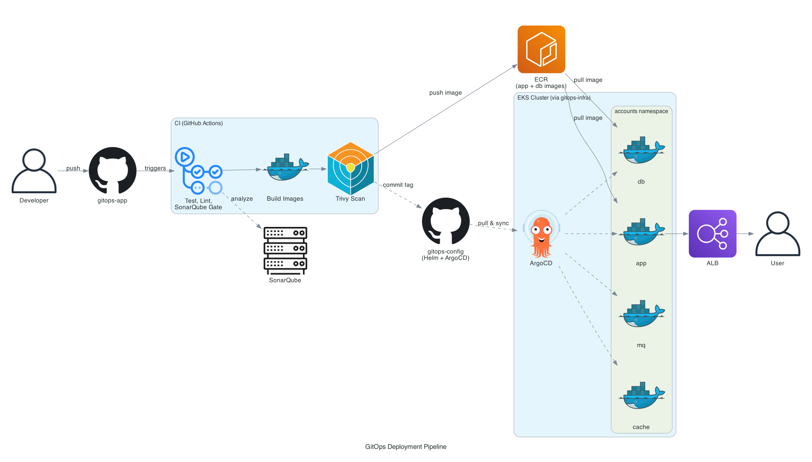

# gitops-config

The Helm chart and ArgoCD manifests for the accounts application. This is the
repo ArgoCD watches: CI never deploys to the cluster directly, it only commits
new image tags here and ArgoCD reconciles the cluster to match.

Part of a three repo GitOps project:
- **gitops-config** (this repo) - what gets deployed
- [gitops-app](https://github.com/tunasahinoglu/gitops-app) - the application
  and the CI pipeline that updates this repo
- [gitops-infra](https://github.com/tunasahinoglu/gitops-infra) - Terraform
  for the VPC and EKS cluster

## Architecture



## Layout

```
helm/accounts/      Chart for the app, database, cache and message queue
argocd/apps/        ArgoCD Application definition
argocd/projects/    ArgoCD AppProject that scopes what the app may deploy
```

## How deploys happen

1. A push to `main` in gitops-app builds and pushes new images to ECR.
2. That pipeline commits the new image tags into `helm/accounts/values.yaml`
   here.
3. ArgoCD sees the commit and syncs the cluster.

`syncPolicy` has `selfHeal: true`, so manual changes made directly against
the cluster get reverted back to whatever this repo says. Git is the source
of truth, not the cluster.

The `image` fields in `values.yaml` start as placeholders. The first CI run
replaces them with real ECR URLs, so there's no account ID committed here.

## Secrets

No passwords are committed. The chart reads them from a Kubernetes secret
that already exists in the cluster:

```bash
kubectl create namespace accounts

kubectl create secret generic accounts-secret \
  --namespace accounts \
  --from-literal=db-pass='...' \
  --from-literal=rmq-pass='...' \
  --from-literal=admin-pass='...'
```

For a local install outside ArgoCD, the chart can create the secret instead:

```bash
helm install accounts ./helm/accounts \
  --set secrets.create=true \
  --set secrets.dbPassword=... \
  --set secrets.rmqPassword=... \
  --set secrets.adminPassword=...
```

## Applying the ArgoCD manifests

```bash
kubectl apply -f argocd/projects/accounts-project.yaml
kubectl apply -f argocd/apps/accounts.yaml
```

The ingress expects the AWS Load Balancer Controller to be installed in the
cluster (see gitops-infra).
